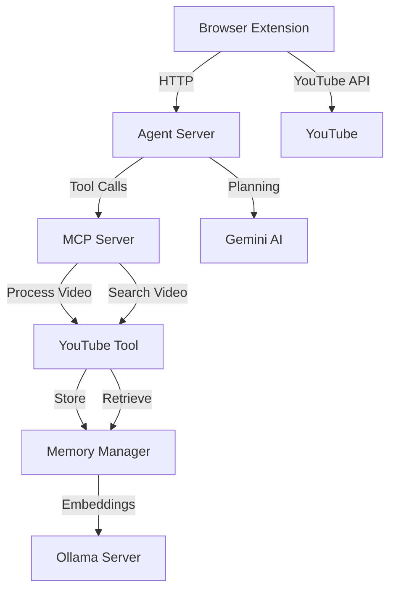

# YouTube RAG Assistant

A powerful browser extension that enables semantic search across multiple YouTube videos using Retrieval-Augmented Generation (RAG) technology. It combines a Chrome extension front-end with a robust Python-based backend to process, index, and search through YouTube video transcripts using embeddings, vector search, and AI planning.

---

## System Architecture



---

## Detailed Example

### 1. User Input
- **Topic**: "Machine Learning Basics"
- **Query**: "What is gradient descent and how does it work?"

### 2. System Flow
```
User → Extension → Agent Server → YouTube Search → Video Processing → Search Results
```

### 3. Step-by-Step Process
- Extension searches YouTube for relevant videos
- Top 3 videos are selected
- For each video:
  - Extract transcript using `youtube-transcript-api`
  - Handle multiple languages (fallback to English)
  - Chunk transcript into semantic segments (10–30 sec, 5 sec overlap)
  - Generate embeddings using `nomic-embed-text` via Ollama
  - Store chunks in FAISS vector DB
- Perform hybrid semantic + keyword + temporal search
- Return timestamped results

### 4. Sample Results
```
Video: "Introduction to Machine Learning"
- [05:23] Gradient descent is an optimization algorithm used to minimize a function...
- [08:45] The algorithm works by iteratively moving in the direction of steepest descent...

Video: "Deep Learning Fundamentals"
- [12:15] In gradient descent, we calculate the gradient of the loss function...
- [15:30] The learning rate determines how big of a step we take in each iteration...
```

---

## Project Overview

### Components

#### 1. **Browser Extension**
- Chrome-based UI for input/query
- Displays timestamped search results
- Plays specific video segments

#### 2. **Backend System**
- Python FastAPI server
- Runs Ollama embedding model
- Integrates YouTube API + transcript extraction + vector search

---

## Layered Architecture

### Backend Layers

| Layer | File | Responsibilities |
|-------|------|------------------|
| **Agent** | `agent.py` | HTTP API, request routing, system orchestration |
| **Decision** | `decision.py` | Uses Gemini AI to plan tool calls, validate actions |
| **Action** | `action.py` | Executes tool calls, error handling, result formatting |
| **Memory** | `memory.py` | FAISS vector DB operations, embedding storage/search |
| **Perception** | `perception.py` | Extracts metadata, parses user intent |
| **YouTube Tool** | `youtube_tool.py` | Transcript extraction, chunking, indexing |
| **MCP Server** | `mcp-server.py` | Tool management interface, validation logic |

### Browser Extension Layers

| Component | Files | Functionality |
|----------|-------|---------------|
| **Popup UI** | `popup.html`, `popup.js` | Input fields, display results, link to timestamps |
| **Content Script** | `content.js` | Extracts YouTube metadata, interacts with DOM |
| **Background Script** | `background.js` | Extension lifecycle, permissions, communication |

---

## Features

- 🔍 Semantic and keyword search across multiple YouTube videos
- 🎯 Timestamp-based navigation to relevant segments
- 🧠 AI-assisted decision making with Gemini
- 🧩 Intelligent transcript chunking (semantic + temporal)
- 🧮 FAISS vector-based similarity search
- 🚀 Parallel and batch processing for performance
- 🧰 Robust error handling and retry mechanisms
- 🔐 Secure architecture (no API keys in the extension)

---

## Technical Details

### Embeddings & Vector Search
- **Model**: `nomic-embed-text` via Ollama
- **Database**: FAISS
- **Chunking**:
  - Min: 10 sec, Max: 30 sec
  - Overlap: Natural overlap from transcripts segments
  - Semantic boundaries and timestamp preservation

### Video Processing Pipeline
1. Transcript extraction (language fallback logic)
2. Semantic chunking with contextual windowing
3. Embedding generation and vector storage

### Hybrid Search Strategy
- Embedding-based semantic similarity
- Keyword-based matching
- Temporal relevance ranking

### Error Recovery
- Retry on failed transcript extraction
- Fallback to alternative videos if needed
- Graceful degradation of search quality
- Caching for previously processed videos

### Performance Optimization
- Batch processing of video segments
- Parallel processing of multiple videos
- Efficient memory use and caching

---

## Setup Instructions

### Prerequisites

- Python 3.8+
- Chrome browser
- [Ollama](https://ollama.com/) (for local embedding model)
- Install Python packages:
  ```bash
  pip install fastapi uvicorn pydantic faiss-cpu numpy requests youtube-transcript-api beautifulsoup4 python-dotenv google-generativeai
  ```

### Backend Setup

1. Clone this repository
2. Set environment variable:
   ```env
   GEMINI_API_KEY=your_gemini_api_key
   ```
3. Run Ollama server:
   ```bash
   ollama serve
   ```
4. Start the backend server:
   ```bash
   RUN_AS_SERVER=true python agent.py
   ```

### Extension Setup

1. Open Chrome → `chrome://extensions/`
2. Enable **Developer mode**
3. Click **Load unpacked** and select the `youtube_rag_extension` folder
4. Extension should now appear in the toolbar

---

## Usage

1. Click the extension icon
2. Enter a **topic** (e.g., "Neural Networks")
3. Enter a **query** (e.g., "How do backpropagation algorithms work?")
4. Click **Search**
5. Review the results with timestamped segments
6. Click a timestamp to jump to that part of the video

---

## Development Guidelines

### Feature Development
- Follow layered architecture
- Include error handling and validation
- Document all changes

### Testing
- Write unit tests for each module
- Add integration tests for the pipeline
- Benchmark performance
- Simulate edge cases and failures

### Debugging & Monitoring
- Use layered logging (perception, memory, action, etc.)
- Track memory usage and performance
- Log retries and fallback behavior

---

## Security Considerations

- No sensitive data (e.g., API keys) stored in extension
- Secure HTTP communication with backend
- Proper permission scopes for Chrome extension
- Input validation and sanitization throughout the stack
