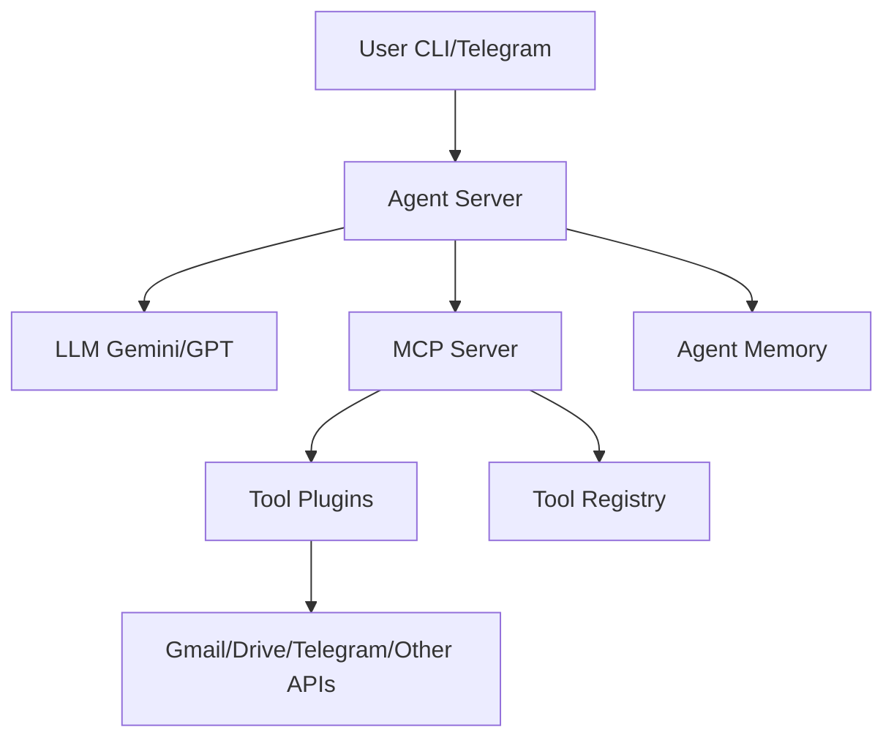

# Modular Multi-Tool AI Agent System

A robust, multi-layered AI agent platform that can process user requests from CLI or Telegram, plan multi-step workflows, and call external tools (via stdio or HTTP) such as Gmail, Google Drive (spreadsheets), and Telegram. The system is designed for flexible, composable workflows like:
**"Telegram message → F1 data fetch → Spreadsheet creation → Email sending."**

---

## System Architecture

> **Note:** The following diagram uses Mermaid syntax. If you do not see a rendered diagram, please view this README on GitHub or with a Mermaid-enabled Markdown viewer.



**ASCII fallback:**
```
User (CLI/Telegram)
        |
        v
  [Agent Server]
        |
   +----+----+
   |         |
Planning   Tool Calls
   |         |
 [LLM]   [MCP Server]
             |
        [Tool Plugins]
             |
      [Gmail/Drive/Telegram]
```

---

## Example Workflow

### 1. User Input
- **Telegram/CLI**: "Create a spreadsheet and mail me the top 10 F1 racers at sunilks.eminem@gmail.com"

### 2. System Flow
```
User → Agent Server → LLM Planning → Tool Calls (search, spreadsheet, email) → User
```

### 3. Step-by-Step Process
- User sends a request via Telegram or CLI.
- Agent server receives the request and queries the LLM for a multi-step plan.
- LLM outputs a sequence of FUNCTION_CALLs (e.g., search, extract_webpage, create_spreadsheet, send_email).
- Agent parses and executes each tool call via the MCP server.
- Each tool (Gmail, Drive, Telegram, etc.) is called via HTTP or stdio, with arguments extracted from previous tool outputs.
- Results are stored in agent memory for context and chaining.
- Final result (e.g., confirmation, link, or error) is sent back to the user.

---

## Project Overview

### Components

#### 1. **Agent Server**
- Orchestrates user requests, LLM planning, tool execution, and memory.
- Supports both CLI and Telegram interfaces.

#### 2. **LLM Planning**
- Uses a planning prompt with multi-step examples and meta-instructions.
- Chains tool calls as needed to fulfill user intent.
- Always outputs valid JSON for tool arguments.

#### 3. **MCP Server**
- Registers and manages available tools.
- Handles tool discovery and invocation (HTTP or stdio).
- Provides robust error handling and logging.

#### 4. **Tool Plugins**
- Gmail: Send emails.
- Google Drive: Create and populate spreadsheets.
- Telegram: Send/receive messages.
- Web extraction: Extract tables/lists/markdown from webpages.
- Extensible for additional tools.

#### 5. **Memory**
- Stores tool outputs and user context for chaining and reference.
- Used by the agent for context-aware planning.

---

## Layered Architecture

| Layer         | File(s)                        | Responsibilities                                  |
|---------------|-------------------------------|---------------------------------------------------|
| **Agent**     | `agent.py`, `core/loop.py`    | User interface, orchestration, session management |
| **Decision**  | `modules/decision.py`         | LLM planning, prompt construction, plan parsing   |
| **Action**    | `modules/action.py`           | Tool call parsing, execution, result formatting   |
| **Memory**    | `modules/memory.py`           | Memory storage, retrieval, context management     |
| **Perception**| `modules/perception.py`       | Intent extraction, LLM output parsing             |
| **MCP Server**| `mcp_server_tools.py`, `mcp_server_fastapi.py` | Tool registry, HTTP/stdio tool execution         |
| **Tools**     | `gmail_tool.py`, `gdrive_tool.py`, `telegram_tool.py`, etc. | API integrations, data extraction                |

---

## Features

- 🔗 **Multi-step tool chaining** (search → spreadsheet → email, etc.)
- 🤖 **LLM-based planning** with robust prompt engineering
- 🧩 **Modular tool registration** (easy to add new tools)
- 🧠 **Contextual memory** for chaining and reference
- 🛡️ **Error handling** and fallback logic for user-facing reliability
- 📊 **Structured data extraction** (tables/lists/markdown from web)
- 📱 **Telegram and CLI interfaces**
- 📝 **Detailed debug logging** and pretty-printed tool responses

---

## Technical Details

### Tool Integration
- Tools are registered with the MCP server and discoverable by the agent.
- Each tool has a clear description, argument schema, and usage example.
- Tools can be called via HTTP (FastAPI) or stdio.

### LLM Planning
- Planning prompt includes multi-step examples and meta-instructions.
- LLM is instructed to always output valid FUNCTION_CALLs and a FINAL_ANSWER.
- Fallback logic ensures user always receives a confirmation.

### Data Extraction
- Web extraction tool returns markdown, tables, and lists as structured data.
- Data is parsed and passed between tools as needed (e.g., spreadsheet rows).

### Error Recovery
- Diagnostic print/log statements throughout the agent loop and planning code.
- Fallback FINAL_ANSWER if LLM fails to output one.
- User always receives a confirmation or error message.

---

## Setup Instructions

### Prerequisites

- Python 3.8+
- [Google Cloud credentials](https://cloud.google.com/docs/authentication/getting-started) for Gmail/Drive tools
- Telegram bot token (for Telegram interface)
- (Optional) Gemini or OpenAI API key for LLM planning

### Installation

```bash
pip install -r requirements.txt
```

### Environment Variables

Create a `.env` file with:
```
GMAIL_API_KEY=your_gmail_api_key
GOOGLE_DRIVE_API_KEY=your_drive_api_key
TELEGRAM_BOT_TOKEN=your_telegram_token
GEMINI_API_KEY=your_gemini_api_key
```

### Running the System

**Start the MCP server (FastAPI):**
```bash
uvicorn mcp_server_fastapi:app --reload
```

**Start the agent (CLI or Telegram):**
```bash
python agent.py
# or
python telegram_agent_runner.py
```

---

## Usage

1. **Send a request** via CLI or Telegram (e.g., "Create a spreadsheet and mail me the top 10 F1 racers at you@example.com").
2. **Agent plans and executes** the workflow, calling tools as needed.
3. **Receive confirmation** (and links, if appropriate) in your interface.

---

## Development Guidelines

- Follow layered, modular architecture.
- Add new tools by registering them with the MCP server and providing clear descriptions.
- Write unit and integration tests for new features.
- Use pretty-printed debug logs for troubleshooting.
- Document all changes and update this README as needed.

---

## Security Considerations

- Do not commit API keys or credentials to version control.
- Validate and sanitize all user inputs.
- Use secure HTTP communication for all tool calls.
- Limit tool permissions to only what is necessary.

---

## Example User Stories

- **"Send me the top 10 F1 racers in a spreadsheet and email it to me."**
- **"Extract a table from a webpage and save it to Google Drive."**
- **"Send a Telegram message with the latest F1 results."**

---

## Troubleshooting

- Check debug logs for `[error]` or `[DIAG]` messages.
- Ensure all required environment variables and credentials are set.
- Use pretty-printed tool responses to diagnose data flow issues.
- If you see `[no result]`, check that the LLM outputs a `FINAL_ANSWER` or that fallback logic is in place.

---

## Extending the System

- Add new tools by implementing a Python function and registering it with the MCP server.
- Update the planning prompt with new multi-step examples for better LLM generalization.
- Integrate additional interfaces (e.g., web, Slack) as needed.

---

## License

MIT License

---

*For questions or contributions, please open an issue or pull request on GitHub.* 